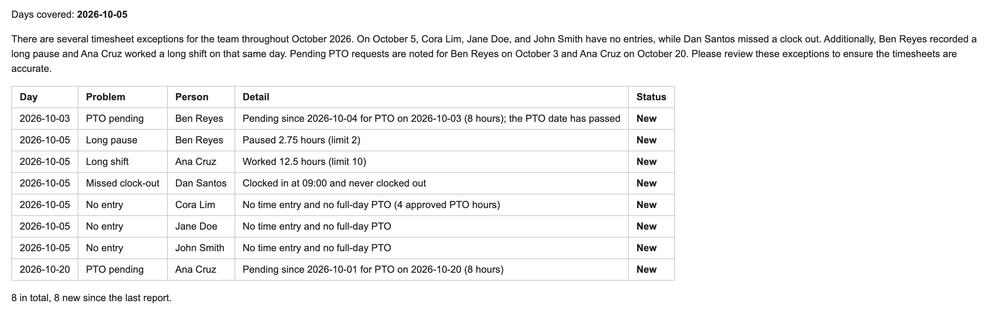
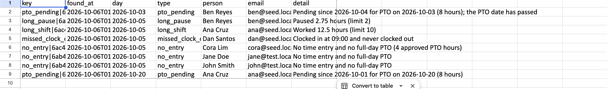

# n8n timesheet check

An [n8n](https://n8n.io) workflow that reads a staff time tracker every morning and reports timesheet problems, so they are caught before they reach a payroll report.

> **Status:** built and tested end to end against a local copy of the time tracker, with real Google Sheets, Gmail and Gemini accounts. It is not yet running on a daily schedule.

It runs on the author's own computer with a local n8n, not on hosted infrastructure. If the computer is off at 8:00, that run is skipped and the next one catches up.



_The summary email. All names and figures shown are invented sample data._

## What it checks

Each run looks at the days since the last successful run (up to 7) and raises an exception for:

| Exception           | Raised when                                                                    |
| ------------------- | ------------------------------------------------------------------------------ |
| `missed_clock_out`  | A time entry from an earlier day was never clocked out.                        |
| `long_shift`        | A completed entry has more than 10 hours worked.                               |
| `long_pause`        | A completed entry has more than 2 hours of breaks.                             |
| `no_entry`          | On a workday, someone has no time entry and no full day of approved PTO.       |
| `no_entries_at_all` | On a workday, nobody has a time entry.                                         |
| `pto_pending`       | A PTO request is still pending after 3 days, or after its own date has passed. |

Workdays are Monday to Friday in the tracker's timezone (Asia/Manila), minus any dates listed as holidays in the settings.

## How it works

The main workflow is `workflows/timesheet-check.json`. It runs at 8:00 every morning (Asia/Manila) and can also be started by hand.

1. Reads the run history from a Google Sheet and works out which days to check.
2. Logs in to the time tracker with a read-only account, and stops if the account is anything stronger.
3. Reads time logs, open entries, PTO requests and users, page by page. It only ever sends GET requests after the login.
4. Checks each response has the expected shape, then finds the exceptions.
5. Reads the exceptions already reported, so nothing is written twice.
6. Asks Google Gemini for a short summary, sending only placeholders, exception types and days. If the reply is missing or fails its check, the report goes out without it.
7. Appends new exceptions to the Sheet, sends the summary email, and records the run last.

## When something goes wrong

Two small workflows make failures visible.

- **`workflows/failure-alert.json`** starts whenever a scheduled run of either other workflow fails. It emails the workflow name, the step that failed and the error message. It leaves out the error's details and stack trace, because those can hold data from the time tracker.
- **`workflows/heartbeat.json`** runs at 10:00 every day and emails a warning if the newest row in the run history is more than 36 hours old, or if there is none.

A failed run records nothing, so the next run covers the same days again without writing anything twice.

Two limits to know about:

- n8n only starts the failure-alert workflow when that workflow is published. `npm run import` publishes it.
- The heartbeat runs inside the same n8n. While n8n is not running it cannot warn anyone; it reports the gap at the first 10:00 after n8n is back.

## What makes it safe to run unattended

The aim is to catch quiet failures, where nothing errors but the result is wrong, as well as loud ones.

| Safeguard                      | What it prevents                                                                                                                                                                                                                            |
| ------------------------------ | ------------------------------------------------------------------------------------------------------------------------------------------------------------------------------------------------------------------------------------------- |
| **Read-only account**          | The time tracker refuses every write from the account the workflow logs in with, so a leaked login or a mistake in the workflow cannot change or delete anything. The workflow also stops if the account turns out to be anything stronger. |
| **Response shape checks**      | If the API's answers change shape, the run stops before anything is written or sent, instead of reporting nonsense.                                                                                                                         |
| **Item count check**           | The number of records read must match the total the API reports, so a missed page cannot go unnoticed.                                                                                                                                      |
| **No-entries warning**         | A workday with no entries at all is called out at the top of the email, since it usually means a holiday or a problem reading the tracker.                                                                                                  |
| **No staff data to the model** | Gemini receives only placeholders, exception types and days. Names are put back afterwards.                                                                                                                                                 |
| **Model reply check**          | An empty, overlong or off-script reply is dropped, and the report goes out without a summary. The report never depends on the model.                                                                                                        |
| **No duplicates**              | Every exception has a key, and only keys not already in the Sheet are written. Reruns and catch-up runs are harmless.                                                                                                                       |
| **Run history written last**   | A run that fails partway records nothing, so the next run does the same days again.                                                                                                                                                         |
| **Catch-up**                   | After missed mornings, the next run covers the days since the last successful run, up to 7. The email says which days it covered.                                                                                                           |
| **Limited retries**            | Data and model calls retry up to three times. The login retries at most twice, to stay clear of the tracker's lockout after five failed logins.                                                                                             |
| **Failure alert**              | Any failed scheduled run sends an email naming the step and the error.                                                                                                                                                                      |
| **Heartbeat**                  | A daily check warns when no run has been recorded for 36 hours.                                                                                                                                                                             |
| **No secrets in the repo**     | Credentials live in n8n, and addresses and ids in `.env`. A test fails if any of them appear in a workflow file.                                                                                                                            |

New exceptions are also appended to a Google Sheet, which doubles as the record of what has been reported:



## Hand-written code

The workflows use n8n's own nodes for the schedule, HTTP requests, Google Sheets, Gmail and Gemini. Everything that decides something is hand-written JavaScript with tests: which days to check, what counts as an exception, what may be sent to the model, whether its reply is usable, and what the emails say.

The logic lives in `src/` as plain JavaScript with no dependencies. `npm run build` copies each file, unchanged, into the Code nodes of the workflow, and a test fails if the workflow file and `src/` ever differ.

| File                    | What it does                                                                                                               |
| ----------------------- | -------------------------------------------------------------------------------------------------------------------------- |
| `src/daysToCheck.js`    | Works out which days a run should cover, including catching up after missed runs.                                          |
| `src/shapeChecks.js`    | Checks each API response has the fields the workflow relies on, and that the login is a read-only account.                 |
| `src/findExceptions.js` | Turns time logs, users and PTO requests into the list of exceptions.                                                       |
| `src/llmSummary.js`     | Replaces names with placeholders before anything is sent to the language model, checks the reply, and puts the names back. |
| `src/report.js`         | Marks exceptions already reported, and builds the Sheet rows, the run-history row and the email.                           |
| `src/alerts.js`         | Builds the failure alert, and decides whether the heartbeat should warn.                                                   |

### Settings

Defaults are at the top of `src/findExceptions.js`, `src/daysToCheck.js` and `src/alerts.js`.

| Setting           | Default       | Meaning                                                 |
| ----------------- | ------------- | ------------------------------------------------------- |
| `maxWorkedHours`  | `10`          | Worked hours above this are a long shift.               |
| `maxPauseHours`   | `2`           | Break hours above this are a long pause.                |
| `ptoPendingDays`  | `3`           | Days a PTO request may stay pending.                    |
| `fullDayPtoHours` | `8`           | Approved PTO hours that count as the whole day off.     |
| `maxCatchUpDays`  | `7`           | How far back a run looks after a gap.                   |
| `holidays`        | `[]`          | Dates (`YYYY-MM-DD`) nobody is expected to work.        |
| `timezone`        | `Asia/Manila` | Timezone used to decide which day something belongs to. |
| `maxSilentHours`  | `36`          | How long the heartbeat waits for a run before warning.  |

## Running the tests

Requires Node 24 or newer. There is nothing to install.

```bash
npm test
```

All sample data in the tests is invented. The tests also check that the workflow file contains no email address, Sheet ID, host name or credential.

## Setup

Built and tested with n8n 2.41.6.

### 1. Settings

Copy `.env.example` to `.env` and fill it in. `.env` is never committed.

### 2. Start n8n

```bash
npm run n8n
```

This loads `.env`, lets the workflow read those settings, and starts n8n at `http://localhost:5678`. Keep the terminal open; closing it stops n8n and the schedule.

### 4. The Google Sheet

Two tabs, with these headers in row 1:

- `Exceptions`: `key`, `found_at`, `day`, `type`, `person`, `email`, `detail`
- `Runs`: `run_at`, `days_covered`, `new_exceptions`, `total_exceptions`

### 5. Import the workflows

Stop n8n (Ctrl+C), then:

```bash
npm run import
npm run n8n
```

`npm run import` attaches your credentials to the nodes that need them, imports the three workflows, and publishes the failure-alert workflow. It replaces the same three workflows each time, so it is safe to run again.

Open "Timesheet check" in n8n and run it once by hand. When you are happy with the result, publish "Timesheet check" and "Timesheet check - heartbeat" so they run on their schedules. Importing again switches them off, so publish them again afterwards.

### Changing the logic or settings

Edit the files in `src/` (or the settings in `scripts/build-workflows.js`), then:

```bash
npm test
npm run build
npm run import
```
